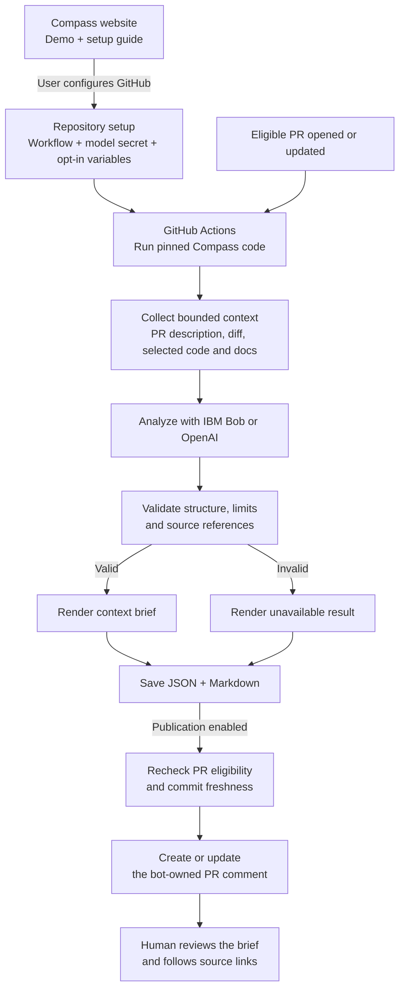

# PR Compass


**IBM Bob Hackathon | Two-person team**

PR Compass gives human reviewers a compact, evidence-linked GitHub comment with
**Purpose**, **Relevant context**, and **Suggested reading order**. North is its
visual guide. Compass does not approve, merge, or edit the pull request.

## Current status

The repository contains an opt-in automatic GitHub workflow with IBM Bob and
OpenAI providers, validated structured output, progress checks, and a comment
publisher. The separate `compass-web` website contains the demo and setup guide;
GitHub Actions runs the reviews. This repository retains the original brief viewer. Live Bob analysis, North App publication, and automatic comment refresh have been verified. Website deployment and public onboarding remain pending.

Start with [GitHub + Vercel setup](docs/VERCEL-GITHUB.md). The optional hosted
GitHub App implementation is documented separately in [docs/GITHUB-APP.md](docs/GITHUB-APP.md).

Verified runs and limitations are recorded in [live verification](docs/LIVE-VERIFICATION.md).
[PR #3's North comment](https://github.com/lixu4n/pr-compass/pull/3#issuecomment-5852849724)
demonstrates a real code-change brief. [PR #4's automatic brief](https://github.com/lixu4n/pr-compass/pull/4#issuecomment-5852888873)
replaced the same bot comment after a new commit. Passing schema validation does
not prove factual accuracy; the review found a workflow-description error in PR #4.
Actual provider charges and the demo recording remain unverified.

External users can install the workflow and supply their own model key today;
without their own App configuration, it posts as `github-actions[bot]`.
Installing the public Compass App alone does not enable reviews. Never distribute
Compass's private key. See [external-user setup](docs/EXTERNAL-USERS.md).

## Architecture

Compass runs in GitHub Actions and posts source-linked context for human PR review. The public website provides a demo and setup guide.



### Current scope

- **Verified:** live Bob analysis, North App publication, automatic PR triggers, and updates to the same comment.
- **Authentication:** the standard GitHub Actions token posts as `github-actions[bot]`; a configured GitHub App token posts as that app, including its avatar.
- **Model access:** users supply their own provider key through GitHub Secrets. Selected repository context is sent to that provider.
- **Boundaries:** Compass does not execute target PR code, approve reviews, merge PRs, or edit source files. Collection is bounded, and validation does not guarantee factual accuracy.
- **Not yet deployed:** hosted GitHub sign-in, model connection, and installation-only onboarding. Installing the public Compass App alone does not activate reviews.
- **Separate viewer:** the original React viewer reads static `ReviewBrief` data; the automation produces `ContextBrief` JSON and Markdown.

See [live verification](docs/LIVE-VERIFICATION.md) for evidence and known limitations, and [external-user setup](docs/EXTERNAL-USERS.md) for installation instructions.


## Controlled demo

`.github/workflows/compass-manual.yml` is manual only. It targets this repository's
PR #3 and runs only from `feat/compass-automation`. It checks out the workflow's
exact commit, never the target PR's code. Repair is disabled; the requested total
limit is **0.5 Bobcoins**, with four turns and no automatic rerun attempts.
The vendor cost flag is not an independently verified billing guarantee.

Prerequisites and the verification/recording checklist are in
[docs/DEMO.md](docs/DEMO.md). Do not claim a successful live run until the bot
comment, analyzed commits, and actual usage have been checked.

## Development

Use Node.js 24 (see `.nvmrc`), then:

```bash
npm ci
npm test
npm run typecheck
npm run lint
npm run build
npm run test:action
```

`npm run check:package` verifies the bundled action offline without GitHub or Bob
calls. `npm run test:action` rebuilds the committed distribution and exercises fake
services; it is not a live integration test.

`npm run dev` starts the original brief viewer, also available at `/demo`. Its `public/demo/review-brief.json` remains
illustrative data; the automation produces a separate `ContextBrief` and Markdown
comment. See [automation documentation](docs/AUTOMATION.md) for runtime limits,
authentication, publication rules, and collection limitations.

## Evidence and submission

- [Problem and solution](submission/problem-solution.md)
- [Bob usage](submission/bob-usage.md)
- [Session evidence](bob_sessions/README.md): both teammates' screenshots are included.
- [Evaluation protocol](evidence/evaluation.md): no measured improvement is claimed.

No license file has been selected by the team.
