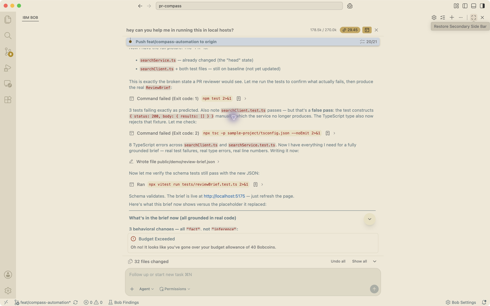
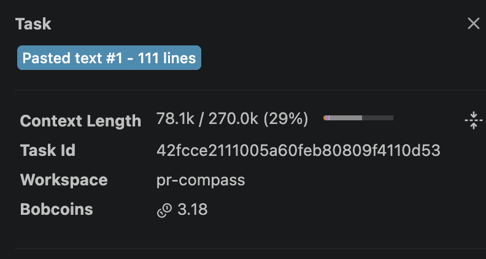

# Bob Session Evidence

## Instructions for both teammates

When you complete a meaningful Bob IDE task related to PR Compass, save evidence of the session:

1. **Take a screenshot** of the Bob IDE task-session summary (the conversation panel showing
   the task, tools used, and outcome).
2. **Name the file** descriptively, e.g. `2024-01-15-review-brief-run.png`.
3. **Save it** in your folder:
   - Teammate one: `bob_sessions/teammate-one/`
   - Teammate two: `bob_sessions/teammate-two/`
4. **Do not** generate fake screenshots, fabricate tool outputs, or copy screenshots from
   other sessions and relabel them.

## What to capture

- The initial skill run on the real sample PR.
- Any session where Bob helped write, debug, or improve project code.
- Any session where Bob analyzed an existing file or produced a review brief.

## What NOT to put here

- Screenshots of other tools (not Bob IDE).
- Any file that was not produced in an actual Bob IDE session.
- Fabricated or edited evidence.

## Included evidence

Captured from the open Bob IDE conversation on 2026-09-26. Shows earlier sample
analysis and tool calls; it is not PR #3 workflow or per-run cost evidence.

